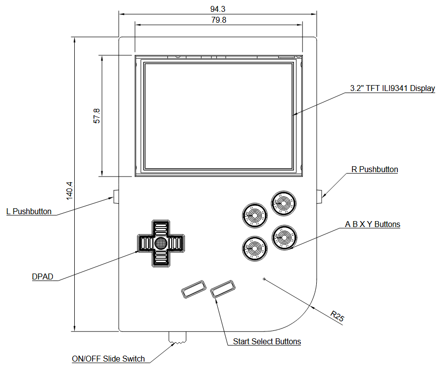
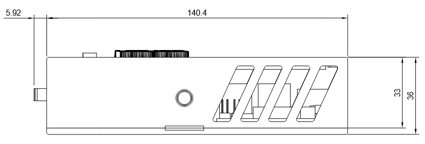
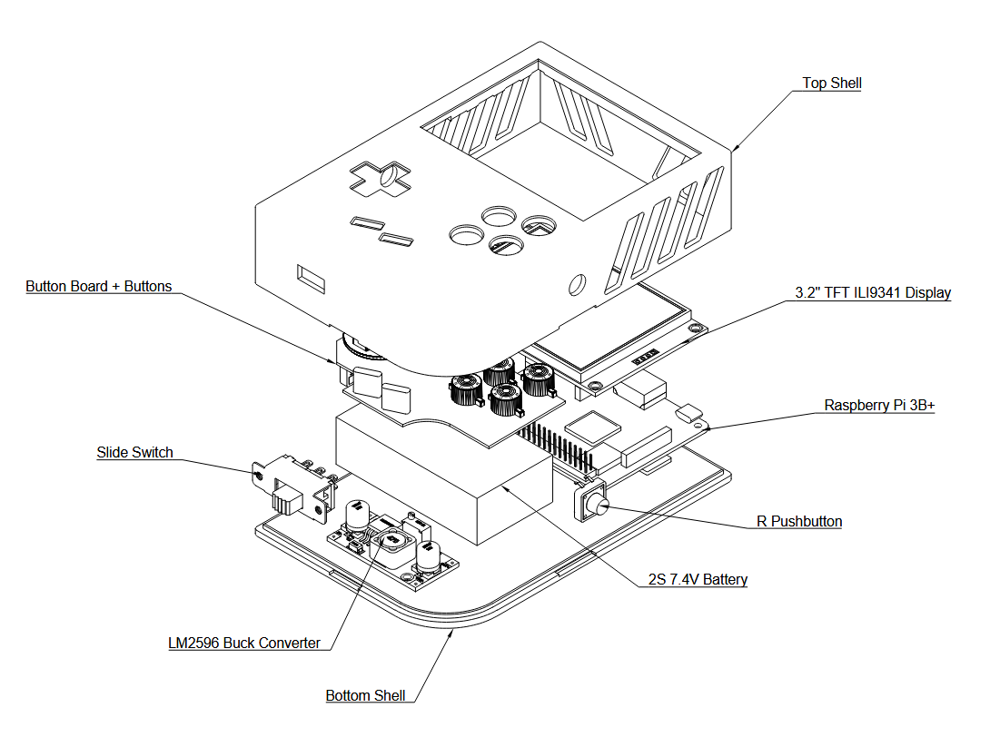
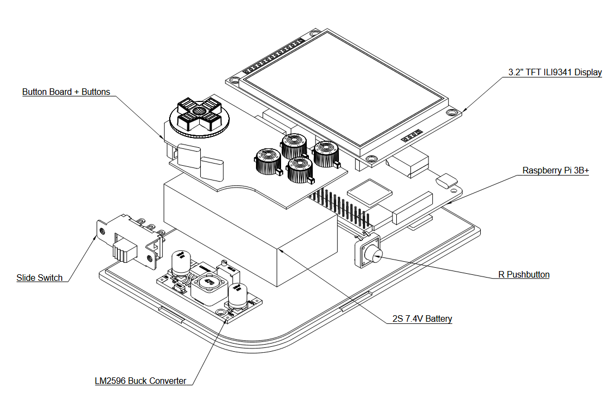
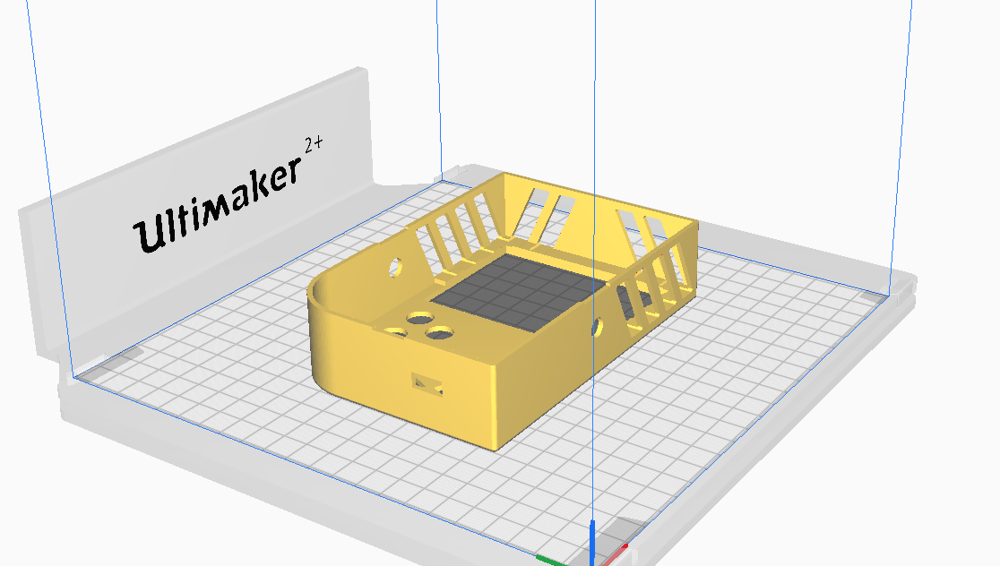
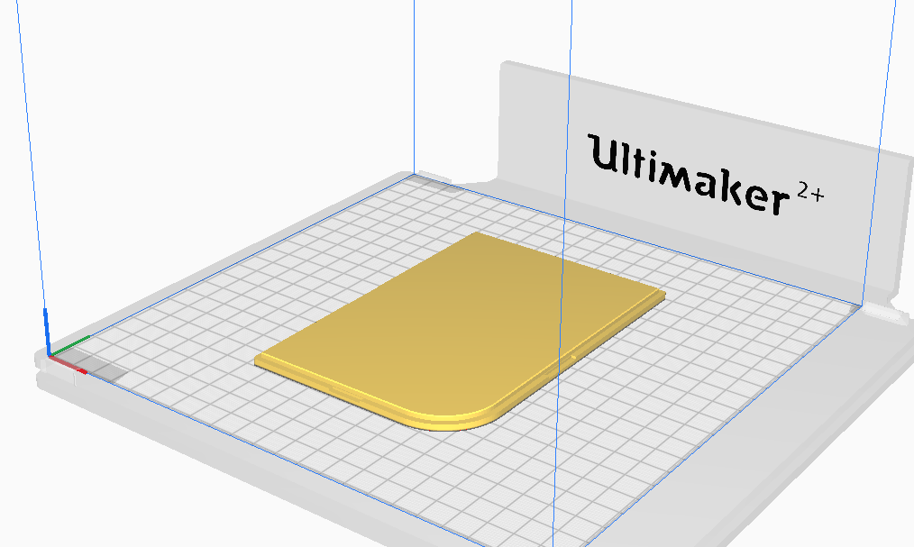

# RetroPi Portable Gaming Console
A Raspberry Pi 3B+ Game Boy‑style build for plug‑and‑play retro gaming

PHOTOS HERE MATE

# Table of Contents

1. [Overview](#overview)
2. [Features](#features)
43. [Performance](#performance)
3. [Design Showcase](#design-showcase)
3. [Bill of Materials](#bill-of-materials)
4. [3D‑Printed Parts](#3d-printed-parts)
5. [Electronics & Wiring](#electronics--wiring)
6. [Software Setup](#software-setup)
8. [Build Instructions](#build-instructions)
9. [Roadmap](#roadmap)
10. [License](#license)

# Overview
This project documents the design and assembly of a hand‑held retro gaming console built around a Raspberry Pi 3B+ and housed in a custom 3D‑printed, Game Boy‑inspired chassis. The goal is a 100 % plug‑and‑play device capable of emulating systems up to the PlayStation 1 era while maintaining performance.

# Features

- Raspberry Pi 3B+ running a custom RetroPie build able to play upto the PS1 era
- 3.2″ SPI TFT driven at 30 FPS via fbcp‑ili9341 library
- Power delivery allowing for battery protection
- GPIO button matrix for authentic handheld controls
- Active thermal management keeps CPU < 60 °C under sustained load
- All parts either off‑the‑shelf or 3D‑printed for easy replication
- Comprehensive build guide, parts list, and CAD files included
- Fully open source under the GNU General Public License v3.0

# Performance

- 30 FPS on the ILI9341 display
- Stable performance for most retro games
- Can run games from systems up to the PlayStation 1 era
- Temperature remains below 60 °C under sustained load with active cooling


From my testing, the Raspberry Pi 3B+ can run most retro games at a stable 30 FPS on the ILI9341 display. Game performance may vary depending on the game and emulator used. The Pi 3B+ is capable of running games from systems up to the PlayStation 1 era, including Wipeout 3 Omega Collection, which runs at 30 FPS with barely any frame drops.

# Design Showcase


<p align="center">
  <br>
  <sub>Front</sub>
  <br><br>
  <br>
  <sub>Side</sub>
</p>
<p align="center">
  <br>
  <sub>Exploded View</sub>
  <br><br>
  <br>
  <sub>Exploded View without Front Shell</sub>
</p>

[Design files](cad/Showcase_Drawings.pdf) available as PDFs in `/cad` folder.

# Bill of Materials
| Category | Item | Description | Quantity | Price ($NZ, Approx.) |
|----------|------|-------------|----------|----------------------|
|Compute| Raspberry Pi 3B+ | Main microcontroller board | 1 | $70 |
|Display| ILI9341 3.2″  320x240 SPI TFT | Main display for the console | 1 | $20 |
|Input| Gameboy Zero PCB Button Board | Custom button board for main controls | 1 | $5 |
|| Generic Push Buttons | Generic push buttons for L and R | 2 | $1 |
|| Original Gameboy Rubber Pads and Buttons | Gameboy buttons for tactile feedback (pick your colour!) | 1 set | $5 |
|| Push Button Caps | Off-the-shelf push button caps for L and R | 2 | $1 |
|Power| 2S 7.4V 3000mAh LiPo Battery | Main power source for the console | 1 | $20 |
|| LM2596 Step Down Converter 3A | Voltage regulator to step down battery voltage to 5V | 1 | $2 |
|| Battery Charger | 2S LiPo battery charger | 1 | $10 |
| | Slide Switch | Power switch for the console | 1 | $2 |
|Miscellaneous| Fan | Dual Fan for active cooling | 1 | $5 |
| | Wiring | Various wires for connections | - | $5 |
|| Soldering Supplies | Solder, flux, etc. | - | $5 |
|| 3D Printing Filament | PLA or ABS for 3D-printed parts | 90g | $10 |

Total Estimated Cost: $170 NZD + Assembly (Approx.) \
Refer to [parts wiki](https://github.com/rbat05/RetroPieGameboy/wiki/Parts) for more details on each component and where to purchase.

# 3D-Printed Parts
Total cost of 3D-printed parts is approximately $10 NZD, using about 90g of PLA filament. Time to print is around 20 hours total. 

STLs, STEPs and Fusion 360 source files are in `/cad` folder. 

The source file details the design of the Gameboy shell, including all dimensions and features. It shows how all components are to be assembled together. The shell is designed to be printed in 2 parts, the front and back. Both components can be printed without supports. 

Infill and resolution settings for Ultimaker 2B+, set on "Fine" resolution.

- **[Gameboy Front.stl](cad/Top_Shell.stl)**
  <br>
  
  - **Print Settings:** 30% infill, 0.1 mm resolution, PLA
  - **Supports:** Not needed if printed on front face 
  - **Adhesion:** Enable adhesion for best result
  - **Material Used:** 52 g
  - **Print Time:** 12 hours

- **[Gameboy Back Cover.stl](cad/Back_Plate.stl)**
  <br>
  
  - **Print Settings:** 20% infill, 0.1 mm resolution, PLA
  - **Supports:** Not needed if printed on back flat side
  - **Adhesion:** Not needed
  - **Material Used:** 38 g
  - **Print Time:** 8 hours 30 minutes

If you'd like to modify the design, the following CAD files are available in the `/cad` folder:

- **[Gameboy Front.step](cad/Top_Shell.step)** – Editable STEP file for the front shell
- **[Gameboy Back.step](cad/Back_Plate.step)** – Editable STEP file for the back shell
- **[Complete Fusion 360 Source](cad/RetroPie%20Gameboy%20CAD.f3d)** – Full project file including the shell, button board, and all components (for Autodesk Fusion 360)

Can also print the buttons if needed, but I used original Gameboy buttons for this project. 

Currently the assembly requires all components to be "sandwiched" between the shell and back cover. The front shell has a cutout for the display, and the back cover just holds the components in place. There are no screws or fasteners required.

In the future, I intend to redesign both parts to properly mount all components. This will allow for easier assembly and disassembly.

# Electronics & Wiring

The electronic can be split into 3 subsystems: Power, Controls, and Display. Each subsystem has its own components and wiring requirements. Keep in mind the space constraints of the Gameboy shell when planning your wiring. \


Full wiring diagram is available [here](Wiring_Diagram.pdf).

### 1. Power 
Li-Po Battery -> Slide Switch -> LM2596 Step Down Converter -> Raspberry Pi 3B+ 5V VDC \
Fan -> Raspberry Pi 5V and GND Pins
### 2. Controls
Gameboy Zero PCB Button Board -> Raspberry Pi GPIO Pins 
| Button        | Pin # |
|---------------|-------|
| A             | 3        |
| B             | 5        |
| X             | 7        |
| Y             | 11       |
| Start         | 13       |
| Select        | 15        |
| DPAD Up       | 29       |
| DPAD Down     | 31       |
| DPAD Left     | 33       |
| DPAD Right    | 32       |
| GND           | GND      |

Generic Push Buttons (L and R) -> Raspberry Pi GPIO Pins 

| Button | Pin #|
|--------|----------|
| L      | 8       |
| R      | 10       |
| GND    | GND      |

### 3. Display 
SPI TFT Display -> Raspberry Pi SPI Pins

| Signal   | Pin # |
|----------|-------|
| SDO (MISO)   | 21   |
| SDI (MOSI)   | 19   |
| SCK          | 23   |
| DC           | 18   |
| RESET        | 22   |
| CS           | 24   |
| LED          | 5V   |
| VCC          | 5V   |
| GND          | GND  |
| *Unused*| T_CLK, T_CS, T_IRQ, T_DO, T_DIN |

Once all components are connected, you can power the Raspberry Pi using the 5V output from the LM2596 Step Down Converter. The converter will step down the 7.4V from the Li-Po battery to a stable 5V required by the Raspberry Pi.


# Software Setup
| Required Software | Description | Link |
|-------------------|-------------|------|
| Retropie OS | Operating system for Raspberry Pi that handles game emulation | [Retropie](https://retropie.org.uk/download/) |
| fbcp-ili9341 | Library to drive the ILI9341 display | [fbcp-ili9341](https://github.com/juj/fbcp-ili9341)|
| GPIOnext | Library to handle GPIO button inputs | [GPIOnext](https://github.com/mholgatem/GPIOnext) |

*You will need a keyboard for the initial setup.*

Flash your SD card with the latest Retropie image using [Raspberry Pi Imager](https://www.raspberrypi.com/software/). Once flashed, insert the SD card into your Raspberry Pi and boot it up. Follow the on-screen instructions to set up your controller and Wi-Fi. 

Install the required cores for the games you want to play, by going to [Retropie Supported Systems](https://retropie.org.uk/docs/Supported-Systems/). For this project, you will be able to play upto the PS1 era, compatibility may vary for other raspberry pi systems. Obtain the game ROMs legally and place them in the appropriate directories on your Retropie setup. You can use a USB drive or SFTP to transfer files to your Raspberry Pi.

Retropie handles the emulation part of the project. The following setup is needed to get the *button board* and the *display* to work. 

Be sure to setup SSH access to your Raspberry Pi for easier configuration.

### Button board
1. **SSH into your Raspberry Pi:**
2. **Clone the GPIOnext repo to your home directory:**
    ```sh
    cd ~
    git clone https://github.com/mholgatem/GPIOnext.git
    ```

3. **Install GPIOnext:**
    ```sh
    bash GPIOnext/install.sh
    ```

4. **Configure the Button Board:**
    - When prompted, select **Joypad 1**.
    - For the number of DPADs, select **1 DPAD**.
    - Choose the following buttons: **START, SELECT, A, B, X, Y, L, R**.
    - The script will prompt you to press each button in sequence—do so as instructed.
    - Save and exit when finished.

5. **Start GPIOnext:**
    ```sh
    gpionext start
    ```
    - Restart your Raspberry Pi. GPIOnext will automatically start on boot.

6. **Remapping Controls (if needed):**
    - If you need to remap any controls, run:
    ```sh
    gpionext config
    ```
    - Follow the prompts to reconfigure your button mappings.

This process ensures your custom button board is correctly recognized and mapped for RetroPie.

Check out this guide for a more in depth set up guide: [Using GPIO Pins For Button Inputs in RetroPie – Building Your Own Retro Gaming Handheld](https://bytesnbits.co.uk/gpio-controller-raspberry-pi-retropie/)

### Display
1. **SSH into your Raspberry Pi:**
2. **Clone and Build fbcp-ili9341 in your home directory:**
    ```sh
    cd ~
    git clone https://github.com/juj/fbcp-ili9341.git
    sudo apt-get install cmake
    cd fbcp-ili9341
    mkdir build
    cd build
    make -j
    sudo ./fbcp-ili9341
    cmake -DILI9341=ON -DGPIO_TFT_DATA_CONTROL=24 -DGPIO_TFT_RESET_PIN=25 -DSPI_BUS_CLOCK_DIVISOR=6 -DSTATISTICS=0 -DDISPLAY_ROTATE_180_DEGREES=ON ..
    ```

2. **Configure fbcp-ili9341 to Run on Startup:**
    - Edit the `rc.local` file:
    ```sh
    sudo nano /etc/rc.local
    ```
    - Add the following line before `exit 0`:
    ```sh
    sudo /home/pi/fbcp-ili9341/build/fbcp-ili9341 &
    ```
    - Save and exit. The LCD panel will start automatically after reboot.

3. **Configure HDMI Settings:**
    - Edit the `/boot/config.txt` file:
    ```sh
    sudo nano /boot/config.txt
    ```
    - Ensure the following lines are present and uncommented:
    ```
    hdmi_force_hotplug=1
    disable_overscan=1
    hdmi_cvt=320 240 60 5 #Custom resolution, framerate for ILI9341
    hdmi_group=2
    hdmi_mode=87
    hdmi_drive=2
    ```
After completing these steps, your ILI9341 display should function correctly with the Raspberry Pi and fbcp-ili9341 library. Check the `fcpp-ili9341` documentation for additional configuration options and troubleshooting (eg: display rotation etc).

Check out this guide for a more in depth set up guide: [RetroPie on a Raspberry Pi Zero at 50FPS on an SPI LCD Screen With ILI9341 Driver](https://bytesnbits.co.uk/retropie-raspberry-pi-0-spi-lcd/).

### Testing the Setup
1. **Reboot your Raspberry Pi:**

    ```sh
    sudo reboot
    ```

2. **SSH into your Raspberry Pi again:**
3. **Verify Button Functionality:**
    - After reboot, the GPIOnext service should start automatically.    
    - Open a terminal and run:
    ```sh
    sudo service --status-all
    ```
    - Look for `gpionext` in the list.
    - If the service is running, you can test the buttons by navigating through the RetroPie menu.
    - If the buttons do not respond, check the wiring and GPIO pin assignments in the GPIOnext configuration.
4. **Verify Display Functionality:**
    - The ILI9341 display should show the RetroPie splash screen and menu.
    - If the display is not working, check the wiring and configuration settings in `/boot/config.txt`.

# Build Instructions

As previously mentioned, the physical assembly of the Gameboy is quite simple. The components are "sandwiched" between the front and back shells, with no screws or fasteners required. The front shell has a cutout for the display, and the back cover holds all components in place.

In the future, I plan to redesign the shell to properly mount all components, allowing for tighter assembly and easier disassembly. This will include proper mounting points for the display, buttons, and Raspberry Pi.

But for now, here are the steps to assemble the Gameboy:

1. **Print the 3D-printed parts** using the provided STL files. Ensure you have enough filament and a suitable printer.

2. **Assemble the electronics** according to the wiring diagram. Ensure all connections are secure and insulated to prevent shorts. Use flexible wires to allow for easy assembly and disassembly. Try using heat shrink tubing or electrical tape to cover exposed wires. 

3. **Install the software** on the Raspberry Pi as described in the Software Setup section. Ensure you have a keyboard connected for initial configuration.

4. **Mount the components** inside the 3D-printed shell. 
    - First place the display in the cutout on the front shell.
    - Then place the Gameboy Zero PCB Button Board, align all front facing buttons with the button cutouts on the front shell.
    - Next, place the battery along with the slide switch and LM2596 buck converter.
    - Finally, place the Raspberry Pi 3B+ in the back shell, along with the L and R buttons.

5. **Secure the back cover** to the front shell. 

# Roadmap

The project is complete, but there are a few improvements that can be made to the design and functionality. The following features are planned for future iterations when I have the time:
- **Battery Management System**: Implement a proper battery management system to handle charging and discharging of the Li-Po battery. This will improve battery life and safety.
- **Improved Power Regulation**: Use a more efficient step-up converter to maintain a stable 5V output from the battery, allowing for longer usage times without needing to adjust the voltage.
- **Better Shell Design**: Redesign the shell to better accommodate the components and improve assembly. This will include proper mounting points for the display, buttons, and Raspberry Pi.

A significant limitation of this project is the high power demand of the Raspberry Pi 3B+, which requires a stable 2.5A at 5V. Due to the lack of readily available step-up modules capable of converting a single-cell (1S, 3.7V) LiPo to 5V at this current, a 2S (7.4V) battery was used in combination with an LM2596 step-down converter.

However, the LM2596 module does not consistently maintain a 5V output as the battery discharges. When the battery voltage drops, the output from the LM2596 also falls below 5V, causing the Raspberry Pi to undervolt. As a result, the device can only operate reliably for about 20 minutes before the voltage needs to be manually readjusted.

**TLDR:**  
- The current power solution limits usable battery life to ~20 minutes per charge.
- Undervoltage issues occur as the battery drains, impacting stability.
- A more robust power regulation solution is needed for longer, reliable operation.

Could be mitigated by using a lower power Raspberry Pi model, such as the Raspberry Pi Zero 2 W, which has lower power requirements and can run most retro games at a stable 30 FPS, before the PS1. The PS1 era games may not run as well, but the Pi Zero 2 W is capable of running most retro games from systems like the NES, SNES, GB, GBA, GBC, Sega Master System, and Mega Drive.


# License
This project is licensed under the GNU General Public License v3.0. You are free to use, modify, and distribute this project as long as you adhere to the terms of the GPLv3 license.

# Current Project Status
The project works, I just need to resolder everything to organise the wires. Project currently on hold (as of 02/03/24).

